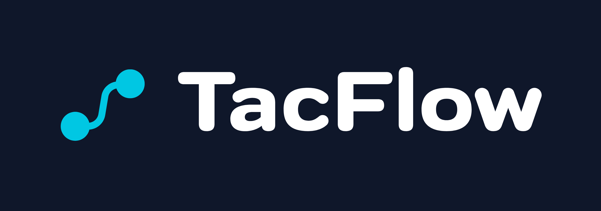
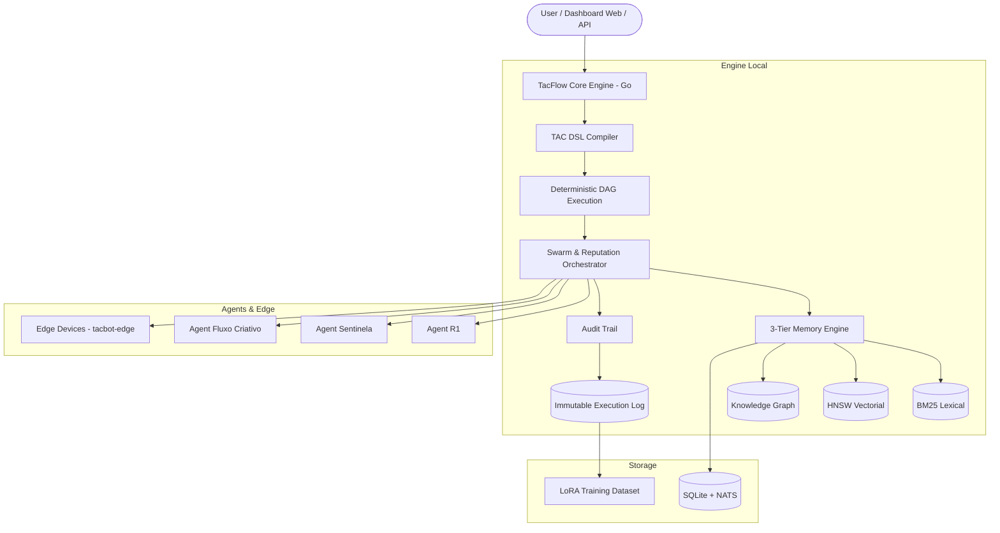

<div align="center">
  
  <h1>TacFlow</h1>
  <p><strong>Local-First • Deterministic Multi-Agent Swarm Platform • Powered by TAC Language DSL</strong></p>

  [](https://github.com/tacflow-ai/tacflow/releases)
  [](https://go.dev)
  [](LICENSE)
  [](https://github.com/tacflow-ai/tac-language)
  [](https://discord.gg/tacflow)
  [](https://github.com/tacflow-ai/tacflow/releases)
  [](https://github.com/tacflow-ai/tacflow/releases)
  [](https://github.com/tacflow-ai/tacflow/releases)

  <br/>
  <a href="#-quick-install">⚡ Quick Install</a> •
  <a href="#-why-tacflow">🌟 Why TacFlow?</a> •
  <a href="#-architecture">🏛️ Architecture</a> •
  <a href="#-unique-technology-pillars">🧠 Unique Pillars</a> •
  <a href="#-swarm-agents">🤖 Swarm</a> •
  <a href="#-roadmap">🗺️ Roadmap</a>
</div>

---

## ⚡ Quick Install

### Windows (PowerShell — Admin)
```powershell
iwr -useb https://get.tacflow.ai/install.ps1 | iex
```

### Linux / macOS
```bash
curl -fsSL https://get.tacflow.ai/install.sh | bash
```

> ✅ One binary, zero dependencies. Installs the full TacFlow Engine, Dashboard, NATS broker, and CLI in under 30 seconds.
> ✅ Works fully offline after install — no cloud dependency for core operations.
> ✅ Native Windows support — no WSL required.

---

## 🌟 Why TacFlow?

Most agent frameworks (AutoGPT, CrewAI, Hermes) rely exclusively on **non-deterministic natural language prompts**. TacFlow introduces a **deterministic compilation layer** through the TAC Language DSL — combining LLM flexibility with the predictability of a traditional compiler.

| Capability | TacFlow | Hermes Agent | CrewAI / AutoGPT |
|:---|---:|:---:|:---:|
| **Execution Language** | TAC DSL (Compiled / Typed) | Raw Text Prompts | Python Scripts / Prompts |
| **Architecture** | Local-First (Single Go Binary) | Multi-container / Cloud | Python Runtime Dependent |
| **Memory System** | **3-Tier** (BM25 + Vector + Graph) | Markdown Files / SQLite | Single Vector Store |
| **Auditability & Compliance** | AST Hash + Cryptographic Trail | Simple Execution Logs | Varies |
| **Agent Portability** | Encrypted Package (`.tacagent`) | Not Supported | Not Supported |
| **Continuous Training** | Auto LoRA Dataset Export | Textual Learning Loop | None |
| **Edge / IoT Support** | Native (`tacbot-edge`) | SSH / API Only | None |
| **Deterministic Flows** | ✅ DAG Compilation | ❌ | ❌ |
| **Offline Operation** | ✅ Full | ❌ | ❌ |
| **Trust Type Validation** | ✅ Compile-Time | ❌ | ❌ |

---

## 🏛️ Architecture



---

## 🧠 Unique Technology Pillars

### 1. TAC Language — The Agentic DSL

A domain-specific language designed **from the ground up for autonomous agents**:

- **Complete Compiler Pipeline:** Lexer → Parser → AST → Semantic Analyzer → Compiler (written in Go)
- **Trust Types System:** 5 levels of variable provenance validated at compile time — prevents agents from acting on unverified data
- **Deterministic DAG Compilation:** Every flow compiles to a Directed Acyclic Graph with guaranteed termination
- **Canonical Round-Trip Formatting:** Every `.tac` file can be formatted, parsed, and re-emitted identically — full auditability
- **Auto LoRA Dataset Generation:** Every execution automatically generates structured training records for fine-tuning

> 📖 [Full TAC Language Documentation](https://github.com/tacflow-ai/tac-language)

### 2. 3-Tier Native Memory

No external vector databases. No cloud dependencies. Three complementary memory engines working in unison:

| Tier | Engine | Best For |
|:---|:---|---:|
| **BM25 Lexical** | Custom Go Index | Exact term search, error codes, paths, identifiers |
| **HNSW Vector** | Native Go HNSW | Semantic intent, concept similarity |
| **Knowledge Graph** | Relational + Edge Store | Causal relationships, decision history, entity mapping |

> 📖 [Memory Architecture Deep Dive](docs/MEMORY_ARCHITECTURE.md)

### 3. Agent DNA & Immutable Owner Chain

Every agent created on the platform carries a **cryptographic birth signature (DNA)**:

- **Dynamic Reputation:** Internal swarm scoring decides autonomously who executes each task based on historical accuracy
- **Owner Chain:** Immutable audit trail recording every transfer, modification, or training received by the agent
- **Portable Export (`.tacagent`):** Complete agent packaging — profile, memories, SQLite database, and skills — into a single AES-256-GCM encrypted file
- **Cross-Swarm Transfer:** Export an agent from one swarm and import it into another with full provenance

> 📖 [Agent DNA & Encryption Deep Dive](docs/AGENT_DNA.md)

---

## 🤖 Swarm Agents

TacFlow natively orchestrates **multi-agent swarms** with:

- **DAG Skill Orchestration:** Skills execute in deterministic order with dependency resolution
- **3 Communication Layers:** NATS broker for local agents, WebSocket for remote, encrypted bridge for cross-swarm
- **Autonomous Self-Healing:** Offline agents are automatically detected and restarted
- **Reputation-Based Task Routing:** Tasks go to the highest-scoring available agent

---

## 🗺️ Roadmap

- [x] TAC Language Compiler (Lexer → Parser → AST → CodeGen)
- [x] Local-First Engine (Go Binary, no runtime deps)
- [x] 3-Tier Memory (BM25 + Vector + Graph)
- [x] Agent DNA & Encrypted Export (`.tacagent`)
- [x] Native Windows Installer (no WSL)
- [x] Swarm Orchestration with Reputation Scoring
- [ ] Public Skill Marketplace
- [ ] Cross-Swarm Federation Protocol
- [ ] Visual Flow Builder (drag & drop TAC)
- [ ] Cloud Hybrid Mode (local + remote agents)

---

## 📄 License

- **TacFlow Engine & Platform:** Proprietary — All Rights Reserved. See [LICENSE](LICENSE).
- **TAC Language DSL Compiler:** Open Source — [MIT License](https://github.com/tacflow-ai/tac-language).
- **TacBot Edge SDK & Examples:** Open Source — [MIT License](https://github.com/tacflow-ai/tacbot-edge).

---

<div align="center">
  <p>Built with Go • Powered by TAC Language • Designed for Deterministic Swarms</p>
  <p>
    <a href="https://tacflow.ai">🌐 Website</a> •
    <a href="https://docs.tacflow.ai">📚 Documentation</a> •
    <a href="https://discord.gg/tacflow">💬 Community</a>
  </p>
</div>
